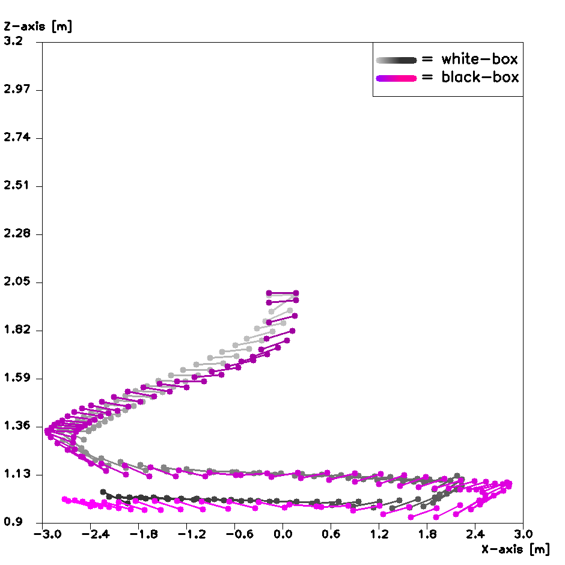

***********************
Crazyflie simulation
***********************
.. contents:: Table of Contents
    :depth: 2

What is the Crazyflie Simulator?
=================
This package is a simulator for the Crazyflie 2.0, a small developer quadcopter.
The simulation is implemented in `EAGERx <https://github.com/eager-dev/eagerx>`_ to make it
possible to easily switch between different simulation models and reality.

The EAGERx framework consist
agnostic and a engine-specific part. The agnostic part could be a controller that need to be trained
before it could be used on the real Crazyflie. At the moment it is just a controller(
``trajectory controller``
) that makes the Crazyflie
go to a certain setpoint. Within the engine-specific part can be chosen between
different objects. The 3 objects that are currently implemented are:

1. A blackbox-model developed by Jacob Kooij; in the code referred to as the ODE model [1]
2. A whitebox-model we developed; in the code referred to as Pybullet
3. The real Crazyflie 2.0


How to use the Crazyflie Simulator
==============
You can run the simulation by running
``autorun_crazyflie_constant_height_updated.py``
. This will first run the whitebox-model and then the blackbox-model.
The length of the simulation can be changed by changing the variable
``max_steps``
. The resulting image is shown in
``final_image.png``
in directory
``Crazyflie_Simulation/solid/Rendering``
, like the picture below:



If you want to change the trajectory flown, you can change it in
``nodes.py``
in the following `line <https://github.com/PietDol/Crazyflie_Simulation/blob/7d496a507e3e319f443e8ea8bcbfa8c059118132/Crazyflie_Simulation/solid/nodes.py#L441>`_
.

```
setpoint = line_trajectory()
```

The options are:

- ``line_trajectory()``
- ``eight_trajectory()``
- ``triangle_trajectory()``
- ``rectangle_trajectory()``

To analyse the differences between the to models can be analysed with
``analyse.py``
. When this file is run, it will create several plots displaying the differences between the to models.

Cite Crazyflie Simulation
===============
If you are using Crazyflie Simulation for your scientific publications, please cite:

.. code:: bibtex

    @article{eagerx,
        author  = {van Dolderen, Pieter-Jan and Gebben, Fabian and Schokker, Ewout and Theunisse, Christiaan},
        title = {Accurate white-box simulation model of the Crazyflie dynamics with the possibility of sim-to-real transfer},
        year = {2022},
    }
\

More information
===================
More information can be found in our `paper <https://github.com/eager-dev/eagerx>`_.

Bibliography
===================
[1] Kooi, J. E., & Babuška, R. (2021). Inclined quadrotor landing using deep reinforcement learning. 2021 IEEE/RSJ International Conference on Intelligent Robots and Systems (IROS), 2361–2368.

